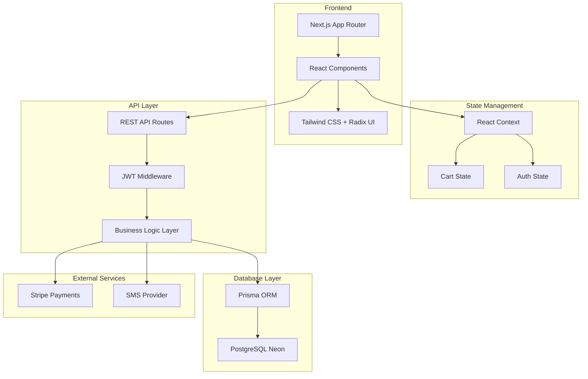

# 🍜 Restaurant Order System - Modern Restaurant Ordering SaaS

<div align="center">
  <!--  -->

  <h3 align="center">Mobile-first modern restaurant ordering SaaS platform</h3>

  <p align="center">
    A full-stack ordering system built with Next.js 15, TypeScript, and PostgreSQL
    <br />
    <a href="#demo"><strong>View Demo »</strong></a>
    <br />
    <br />
    <a href="https://github.com/Cleffa-00/restaurant-order-system/issues">Report an Issue</a>
    ·
    <a href="https://github.com/Cleffa-00/restaurant-order-system/issues">Request Feature</a>
  </p>


</div>

## 📋 Table of Contents

* [Features](#-features)
* [Architecture](#-architecture)
* [Tech Stack](#-tech-stack)
* [Getting Started](#-getting-started)
* [Project Structure](#-project-structure)
* [API Docs](#-api-docs)
* [Deployment Guide](#-deployment-guide)
* [Developer Guide](#-developer-guide)
* [Contributing](#-contributing)

## 🚀 Features

### Client-side

* **📱 Mobile-first design**: Fully responsive with smooth touch experience
* **🛒 Smart shopping cart**: Real-time price updates, swipe-to-remove, fly-to-cart animation
* **🍕 Dynamic menu system**: Category tree structure, required/optional groups, reusable templates
* **💳 Secure payment flow**: Integrated with Stripe, auto tax & service fee calculation
* **📍 Order tracking**: Status from PENDING → PREPARING → READY → COMPLETED
* **🔐 JWT authentication**: Phone number + SMS verification login

### Admin Panel

* **👨‍💼 Role-based access control** (RBAC)
* **📊 Analytics dashboard**: Revenue stats, order trends, sales metrics
* **🍽️ Menu management**: CRUD, category & option group management
* **📋 Order management**: Real-time order board, status updates, bulk actions
* **💰 Income reports**: Daily/weekly/monthly breakdown, CSV export

### Technical Highlights

* **🔷 End-to-end type safety**: From Prisma to REST hooks with Zod
* **⚡ Server-side rendering**: Next.js App Router + Server Actions
* **🎨 Modern UI**: Tailwind CSS + Radix UI + Framer Motion
* **📦 Lightweight state**: React Context + useReducer, no external libs
* **🔄 Real-time updates**: WebSocket for kitchen order syncing

## 🏗️ Architecture



## 🛠️ Tech Stack

| Layer          | Tech                                    | Notes                               |
| -------------- | --------------------------------------- | ----------------------------------- |
| **Frontend**   | Next.js 15 (App Router) · React 18      | File-based routing + Server Actions |
| **Styling/UI** | Tailwind CSS · Radix UI · Framer Motion | Composable + animations             |
| **State**      | React Context + useReducer              | Lightweight, no external lib        |
| **Forms**      | React Hook Form · Zod                   | Full type safety                    |
| **Auth**       | JWT (jose) + middleware                 | hooks/useAuth, useAdminAuth         |
| **Database**   | PostgreSQL @ Neon · Prisma ORM          | Declarative schema + migrations     |
| **Payments**   | Stripe SDK                              | Isolated in `app/api/stripe/`       |
| **Dev Tools**  | TypeScript · ESLint · Prettier          | Type-safe, consistent code          |

## 🚀 Getting Started

### Requirements

* Node.js 18.17+
* pnpm 8.0+
* PostgreSQL database

### Installation

```bash
git clone https://github.com/Cleffa-00/restaurant-order-system.git
cd restaurant-order-system
pnpm install
cp .env.example .env.local
```

Fill in `.env.local`:

```env
DATABASE_URL="postgresql://..."
JWT_SECRET="your-secret-key"
STRIPE_SECRET_KEY="sk_test_..."
STRIPE_WEBHOOK_SECRET="whsec_..."
SMS_API_KEY="..."
```

### Database Setup

```bash
pnpm prisma generate
pnpm prisma migrate dev
pnpm prisma db seed # optional
```

### Run the Dev Server

```bash
pnpm dev
```

Visit: [http://localhost:3000](http://localhost:3000)

**Demo Accounts**

* Admin: 18888888888 / 123456
* User: 13888888888 / 123456

## 📁 Project Structure

```
restaurant-order-system/
├── app/                  # App Router
│   ├── (public)/         # Public routes: menu, cart, checkout
│   ├── (auth)/           # Auth pages
│   ├── (customer)/       # Customer dashboard
│   ├── admin/            # Admin panel
│   └── api/              # API routes
│       └── v1/           # Versioned API
├── components/           # React components
├── lib/                  # Utilities, services, configs
├── contexts/             # Global state context
├── hooks/                # Custom hooks
├── types/                # TypeScript types
├── prisma/               # DB schema
└── docs/                 # Documentation
```

## 📙 API Docs

### Auth

| Endpoint                  | Method | Description            |
| ------------------------- | ------ | ---------------------- |
| `/api/v1/auth/send-sms`   | POST   | Send verification code |
| `/api/v1/auth/verify-sms` | POST   | Verify SMS code        |
| `/api/v1/auth/login`      | POST   | Login                  |
| `/api/v1/auth/register`   | POST   | Register               |
| `/api/v1/auth/refresh`    | POST   | Refresh token          |

### Menu

| Endpoint                 | Method         | Description   |
| ------------------------ | -------------- | ------------- |
| `/api/v1/menu`           | GET            | Full menu     |
| `/api/v1/menu-items`     | GET            | Get all items |
| `/api/v1/menu-items/:id` | GET/PUT/DELETE | CRUD item     |

### Orders

| Endpoint                    | Method | Description   |
| --------------------------- | ------ | ------------- |
| `/api/v1/orders`            | POST   | Create order  |
| `/api/v1/orders/:id`        | GET    | Order details |
| `/api/v1/orders/:id/status` | PUT    | Update status |

Full docs: `/docs/api/`

## 🚢 Deployment Guide

### Vercel (Recommended)

1. Fork this repo
2. Import to Vercel
3. Add env vars
4. Deploy

### Docker

```bash
docker build -t restaurant-order-system .
docker run -p 3000:3000 restaurant-order-system
```

### Manual

```bash
pnpm build
pnpm start
```

## 💻 Developer Guide

### Scripts

| Command              | Description       |
| -------------------- | ----------------- |
| `pnpm dev`           | Dev server        |
| `pnpm build`         | Build app         |
| `pnpm start`         | Start prod server |
| `pnpm lint`          | Run ESLint        |
| `pnpm format`        | Run Prettier      |
| `pnpm test`          | Run tests         |
| `pnpm prisma studio` | Open DB GUI       |

### Code Standards

* Strict TypeScript
* ESLint + Prettier
* Conventional Commits
* Single-responsibility components
* Write tests

### Performance

* Optimize images with Next.js `<Image>`
* Prefetch routes
* Use `React.memo`, `useMemo`
* Optimize Prisma queries

## 🤝 Contributing

1. Fork repo
2. Create branch (`git checkout -b feature/AmazingFeature`)
3. Commit (`git commit -m 'Add feature'`)
4. Push (`git push origin feature/AmazingFeature`)
5. Open PR

### Commit Types

* `feat:` new feature
* `fix:` bug fix
* `docs:` documentation
* `style:` formatting
* `refactor:` code change
* `test:` add tests
* `chore:` build/tooling

## 📄 License

MIT - see [LICENSE](LICENSE)

## 🙏 Acknowledgements

* [Next.js](https://nextjs.org/)
* [Tailwind CSS](https://tailwindcss.com/)
* [Radix UI](https://www.radix-ui.com/)
* [Prisma](https://www.prisma.io/)
* [Vercel](https://vercel.com/)
